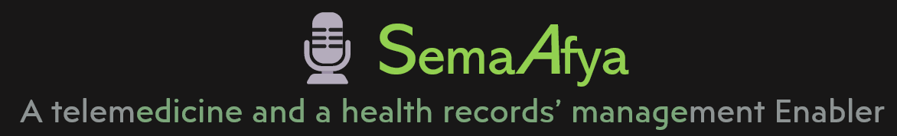

# 🎙️SemaAfya 

Welcome to SemaAfya, your online healthcare platform! Our mottto is: **'Preserving your health is our greatest commitment'**. We believe everyone deserves quality health care regardless of location, language, or access barriers. SemaAfya is committed to eliminating health challenges by providing innovative and fast solutions.The app is deployed at:
https://stt-swahili-mozilla.onrender.com/
  

## About and Rationale for development
### Contemporary medical consultation
SemaAfya is a revolutionary telemedicine platform designed to address healthcare accessibility challenges by integrating cutting-edge technologies, including LLMS (Large Language Models) and ASR (Automatic Speech Recognition), with existing Electronic Health Records (EHRs). The app aims to overcome barriers to timely medical advice, especially in regions with limited healthcare access or for individuals facing language barriers.


## Features

- **Enhanced Documentation Speed**: SemaAfya leverages web-based medical speech recognition technology to significantly increase clinical documentation speed. Studies have shown a 26% improvement, promoting efficiency in healthcare processes.

- **Barrier Reduction for Inclusivity**: The platform focuses on inclusivity by reducing barriers to medical advice. This is crucial for individuals in regions with limited access to healthcare facilities or those facing language barriers, ensuring that everyone can benefit from timely medical consultations.

- **Prompt Consultation Through ASR**: SemaAfya addresses the issue of delayed diagnoses and treatments by utilizing Automatic Speech Recognition (ASR) technology. Patients can receive immediate medical guidance by describing their symptoms using voice, leading to faster and more accurate consultations.

- **Voice-Based Communication**: The app allows patients to describe their health concerns using voice, promoting effective communication even for individuals with varying levels of literacy. This feature enhances the patient experience and ensures that healthcare guidance is accessible to a broader audience.

- **Revolutionizing Patient-Healthcare Interaction**: SemaAfya transforms the way patients interact with the healthcare system. By providing a reliable, accessible, and swift telemedicine solution, the platform contributes to overall well-being and offers a seamless experience for medical consultations.

## How to Run Locally

1. Clone this repository:

```bash
git https://github.com/JuliusFx131/Mozilla-Common-Voice-STT-Challenge
cd path_to_the_cloned_directory
```

## Installation and Setup

1. **Install the requirements using pipenv:**
```bash
pipenv install
```
Note: you need an **OpenAI** API key to run this app locally.
The OpenAI API key should be be in folder ./streamlit/secrets.toml

2. **Activate the virtual environment:**
```bash
pipenv shell
```
3. **Run the streamlit app:**
```bash
streamlit run 🤖_Kuhusu.py
```
## Instructions & Tips

### How to Use:

1. If you wanted to visit our health center, choose **"Yes"** on the question "Would you want to send your medical issue to a doctor? Fill in your phone number in the visible text box. If you're not ready, choose **.
2. **Record** your voice by marking the microphone button. 
2. You can also set the audio you have recorded by clicking the **"Browse Files" button**
3. To read and listen to your voice click the button **Translate Audio** and then wait a little bit 
4. You'll get advice from your health aide and can download the audio and answer to your issue. 

### Tips for the Best Experience:

- Make sure you're in a **quiet environment** if you're going to record your voice.
- Speak **clearly and at moderate speed** recording your voice.
- To upload your pre-recorded file, make sure it is **"mp3"** or **"wav"**.

## Contribute

If you'd like to contribute, please fork the repository and make changes as you'd like. Pull requests are warmly welcomed.

## Feedback

If you have any feedback or issues, please open an issue.

## License

This project is open-source and available under the MIT License.
